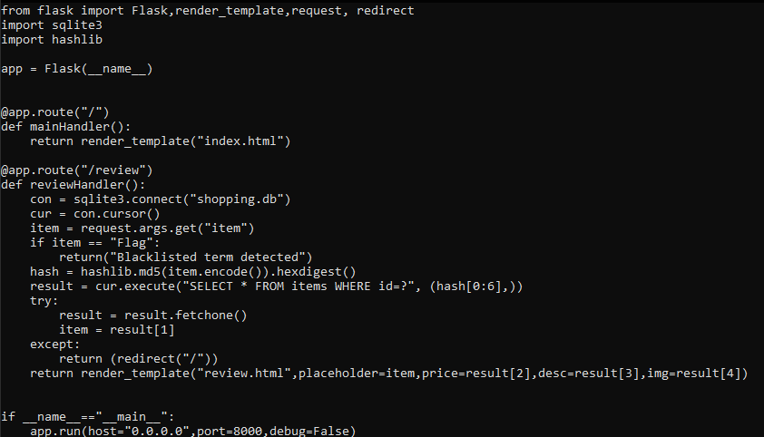

Looking through the app.py. 



Ok, we have sqli and an “item” parameter. The parameter seems to take some value, checks if it’s equal to “Flag”, if not converts it into md5 hash, takes the first 6 elements from the hash and checks for the element in the database using those first 6 elements. 

The vulnerability is in the hashing part. Md5 is widely known for giving the same hash everytime for the value. For example, the md5 hash for “Flag” will always be 

`c5836008c1649301e29351a55db8f65c`

Now all we need to do, is to take the first 6 elements of this hash, and find a collision of these elements with another hash. 

With the help of Chatgpt, I wrote a python script

```python
import hashlib
import random
import string

def generate_random_word(length=8):
    return ''.join(random.choices(string.ascii_letters + string.digits, k=length))

def find_collision(target_prefix):
    attempts = 0
    while True:
        # Generate a random word
        word = generate_random_word(random.randint(5, 10))  # Random word length between 5 and 10
        # Hash the word using MD5
        hash_value = hashlib.md5(word.encode()).hexdigest()
        # Check if the first 6 characters match the target prefix
        if hash_value[:6] == target_prefix:
            return word, hash_value, attempts
        attempts += 1

if __name__ == "__main__":
    target_prefix = "c58360"
    print(f"Target prefix: {target_prefix}")
    word, hash_value, attempts = find_collision(target_prefix)
    print("Collision found!")
    print(f"Word: {word}")
    print(f"MD5 Hash: {hash_value}")
    print(f"Attempts: {attempts}")

```

What it does is basically takes some random words, converts them to md5 and compares the first 6 elements for collision. 
After a while we get some gibberish, “QrqSrB”.

it’s hash is, 

`c58360890b4c7828c68969f3e0f6e878`

We can see the first 6 element match with that of Flag. Placing the value we get our flag.

`TUCTF{k1nd_0f_an_1d0r_vu1n!}`
