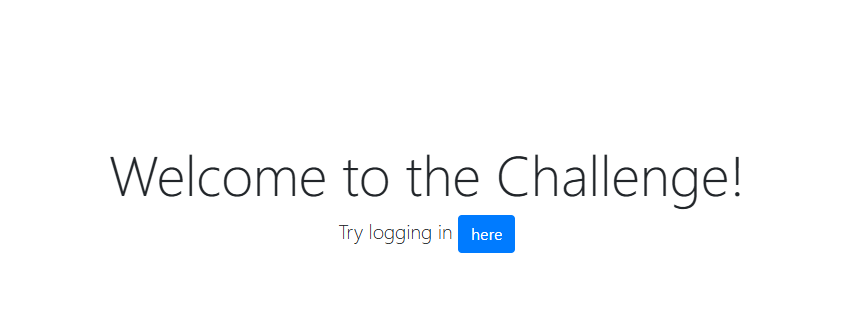
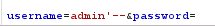
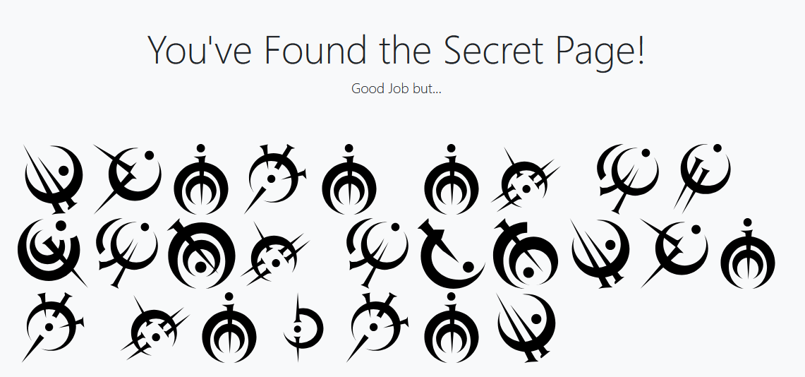
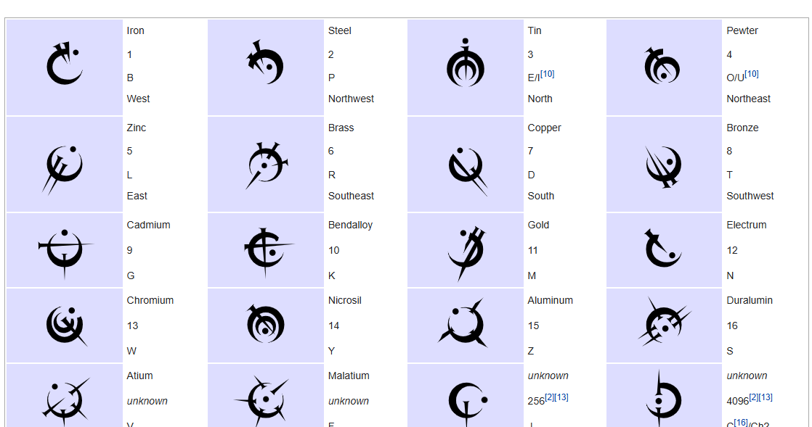

## MY FIRST SECRET:

Opening the site, we are greeted with a welcome page and a link to the login page.

Since the challenge wants us to bypass the login page, I tried the good ol’ SQL injection.

More Secrets.

After some searching, I came across this.

[steel_alphabet](https://coppermind.net/wiki/Steel_alphabet)

From then on, just had to match each figure with the alphabet and in the end it said:

`TUCTF{there_is_always_another_secret}`
